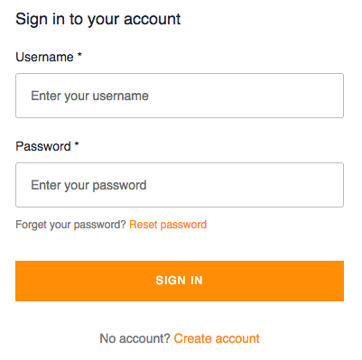

### Overview

This is the third post in a three-part series that shows you how to install 
and configure a serverless web app on AWS using AWS Amplify and AppSync 
for the backend and Create React App for the frontend.

### Configuring your React app:

To connect to the new API, we first need to configure our React project with our Amplify project 
credentials. In your `src` folder there is a file called `aws-exports.js`.
This file holds all of the information our local project needs to know about our cloud resources.

As I mentioned in my previous post, this file should be added to a `.gitignore` file, so if you haven't done so already,
go ahead and run the following command from your terminal:

```shell
$ echo "aws-exports.js" >> .gitignore
```

To configure the React app, open `src/app.js` &amp; add the following lines:

```js
import { withAuthenticator } from 'aws-amplify-react';

import Amplify from 'aws-amplify';

import config from 'aws-exports';

Amplify.configure(config);
```

The last line tells Amplify to use the `aws-exports.js` file to connect to the correct backend API.

You'll notice however that we have some imports that have to do with authentication.

```js
import { withAuthenticator } from 'aws-amplify-react';
```

### withAuthenticator HOC

`withAuthenticator` is a helper function provided by Amplify so we can use the out-of-the-box solution that 
AWS provides us with for auth services.

The `App.js` file should now look something like this:

```js
import React from 'react';
import logo from './logo.svg';
import './App.css'

function App() {
  return (
    <div className="App">
      <header className="App-header">
        
        <h1 className="App-title">Welcome to React</h1>
      </header>
      <p className="App-intro">
        To get started, edit <code>src/App.js</code> and save to reload.
      </p>
    </div>
  );
}

export default App
```

What we'll need to do now is change that last line and paste the line below:

```js
export default withAuthenticator(App, true);
```

To test if everything works as intended, we can run `yarn start` or `npm start` 
and see if we are presented with the default AWS login UI.



In order for us to use our app we now have to register a new user to our API, 
by clicking the 'Create Account' link at the bottom. 

Once we're done registering, AWS will send a confirmation link to the email address we registered.
After that, we are going to be able to login and see the React app in all its glory!

### Setting up Apollo Client for real-time data

One of AppSync's greatest features is its ability for real-time data that is powered by GraphQL subscriptions. 
Instead of implementing this with WebSockets like Apollo Client does, AppSync’s subscriptions use MQTT as the transport layer.

If you want to take advantage of this excellent feature all you need to do is configure your Apollo client.

First step is to create an `ApolloClient.js` file within your `src/graphql` folder that will have the contents below:

```js

// src/graphql/ApolloClient.js

import { Auth } from 'aws-amplify';
import { InMemoryCache } from 'apollo-cache-inmemory';
import AWSAppSyncClient from 'aws-appsync';
import config from '../aws-exports';

const client = new AWSAppSyncClient({
  url: config.aws_appsync_graphqlEndpoint,
  region: config.aws_appsync_region,
  auth: {
    type: config.aws_appsync_authenticationType,
    jwtToken: async () => (await Auth.currentSession()).getIdToken().getJwtToken(),
  },  
  complexObjectsCredentials: () => Auth.currentCredentials(),
  cache: new InMemoryCache(),
});

export default client;
```
For more details on the configuration of the AWSAppSyncClient head over to the Amplify's [configuration options section](https://aws-amplify.github.io/docs/js/api#configuration-options).

After you have saved this file, you need to import the `client` to the `App.js` file, 
so we can use this in our Apollo Provider.

```js
// src/App.js
import { withAuthenticator } from 'aws-amplify-react';
// Add the following lines to your App.js imports
import { Rehydrated } from 'aws-appsync-react';
import { ApolloProvider } from 'react-apollo';
import Amplify from 'aws-amplify';
import config from 'aws-exports';

Amplify.configure(config);

function App() {
  return (
    <div className="App">
      <header className="App-header">
        
        <h1 className="App-title">Welcome to React</h1>
      </header>
      <p className="App-intro">
        To get started, edit <code>src/App.js</code> and save to reload.
      </p>
    </div>
  );
}

const WithProviders = () => (
  <ApolloProvider client={client}>
    <Rehydrated>
      <App />
    <Rehydrated />
  <ApolloProvider />
);

export default withAuthenticator(WithProviders, true);

```

What happened there, is that we wrapped the `App` component with `Rehydrated` and the `ApolloProvider`, 
so that we can get advantage of the AWSAppSync Client. It takes a `client` prop
and this is where we pass on the client we configured earlier in our `ApolloClient.js` file.

Congratulations! You have now successfully connected to the AppSync API from your React app and 
leveraged AppSync's implementation of Apollo Client that enables real-time capabilities in your app!


Stay tuned for the next part of this series that will take you through querying data from our React App using [React Hooks](https://reactjs.org/docs/hooks-intro.html).

Do you think something is missing from this article ?

Let me know on [Twitter](https://twitter.com/SpyrouYannis).
